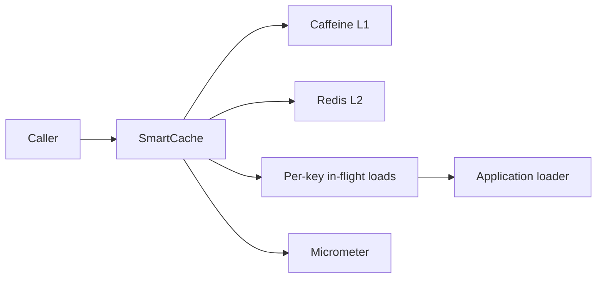
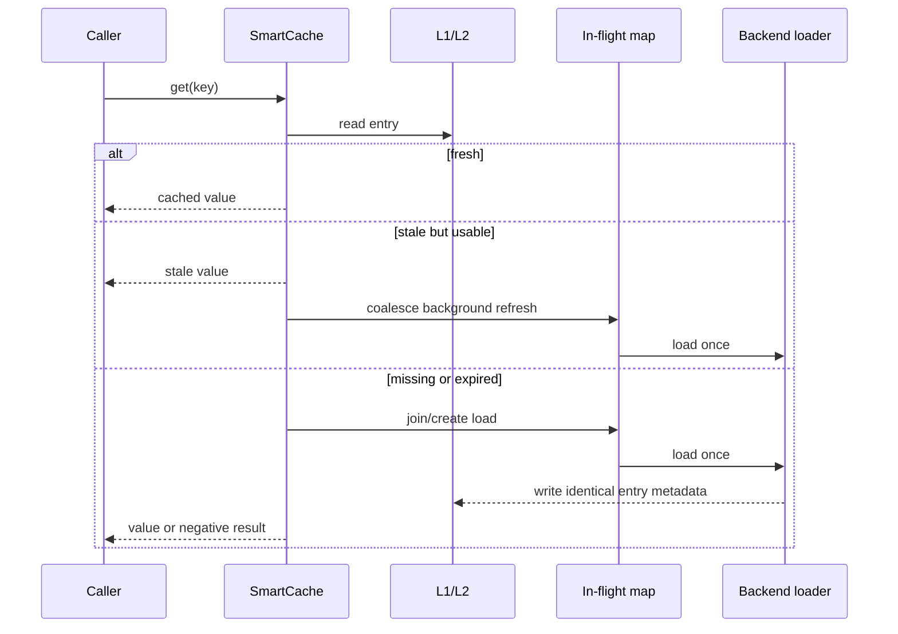

# Spring Smart Cache

Spring Smart Cache is an explicit local/distributed caching toolkit for Spring applications. It combines Caffeine L1 storage, a Redis L2 adapter, TTL jitter, stale-while-revalidate, negative caching, request coalescing, warming, invalidation, and Micrometer metrics.

## Problem Statement

Basic method caching does not define what happens during concurrent misses, backend slowness, negative results, multi-level expiry, or hot-key refresh. Hidden consistency rules lead to stampedes and surprising stale data.

## What This Project Solves

- bounded Caffeine L1 storage
- optional Redis-backed L2 through a small command adapter
- synchronized freshness metadata across levels
- positive and negative TTLs with bounded jitter
- reproducible stale-while-revalidate behavior
- one in-flight load per key per process
- explicit two-level invalidation and warming
- hit, stale, miss, and load metrics

## When To Use It

Use it for high-read Spring service paths where controlled staleness is acceptable and backend loads should be coalesced. Do not use cached values as an authorization source without a consistency analysis.

## Architecture / HLD



## Detailed Design / LLD



Freshness and stale deadlines live inside `CacheEntry`, so L1 and L2 apply the same semantics. Redis physical expiry is the remaining stale deadline, not merely the fresh TTL.

## Public API / API Structure

| Type | Purpose |
| --- | --- |
| `SmartCache<V>` | Lookup, coalescing, refresh, warming, invalidation |
| `CachePolicy` | Positive TTL, stale window, negative TTL, jitter |
| `CacheStore<V>` | L1/L2 storage contract |
| `CaffeineCacheStore<V>` | Bounded local store |
| `RedisCacheStore<V>` | JSON Redis L2 with synchronized expiry |
| `RedisCommands` | Adapter for Lettuce, Spring Data Redis, or another client |
| `CacheMetrics` | Outcome metric hook |
| `MicrometerCacheMetrics` | `smart.cache.requests` counter implementation |

## Core Concepts

Only one load future exists for a key in a process. Concurrent cold misses join it. A stale entry returns immediately and starts the same coalesced path in the configured executor. Empty loader results are cached with the shorter negative TTL.

Jitter multiplies TTL by a value in `[1-jitter, 1+jitter]`. Injecting the random source and clock makes expiry deterministic in tests.

## Local Prerequisites

- JDK 21 or newer
- Git
- Redis only when using the L2 adapter

The Maven Wrapper pins Maven 3.9.12.

## Steps To Run

```bash
git clone https://github.com/aniket-deshkar/spring-smart-cache.git
cd spring-smart-cache
./mvnw verify
```

Use `mvnw.cmd verify` on Windows.

## Configuration

Create a `CachePolicy`, bounded L1, optional L2, refresh executor, clock, jitter source, and metrics implementation. Implement `RedisCommands` using the application's existing Redis client; `set` must honor the supplied physical TTL.

## Usage Examples

```java
CachePolicy policy = new CachePolicy(
    Duration.ofMinutes(5),
    Duration.ofMinutes(1),
    Duration.ofSeconds(20),
    0.10);

SmartCache<Customer> cache = new SmartCache<>(
    new CaffeineCacheStore<>(10_000),
    redisStore,
    policy,
    Clock.systemUTC(),
    Math::random,
    refreshExecutor,
    new MicrometerCacheMetrics(registry));

Optional<Customer> customer =
    cache.get("customer:" + id, key -> repository.findById(id));
```

Use versioned, tenant-aware keys. Call `invalidate` after the source-of-truth transaction commits.

## Testing

Run `./mvnw verify`. The suite exercises 20-way concurrent miss coalescing, stale refresh, negative caching, two-level invalidation, warming, metrics, and invalid configuration with injected clocks and virtual-thread callers. Spotless and PMD run in the same Java 21 CI gate.

## Observability

`MicrometerCacheMetrics` publishes `smart.cache.requests` with outcomes `hit`, `stale`, `miss`, and `load`. Monitor stale ratios, backend load latency in the loader, and errors in the refresh executor. Avoid high-cardinality cache keys in metric tags.

## Security

Cache keys should be opaque, tenant-scoped, and free of credentials. Encrypt Redis transport and storage where required. Cache only data whose retention and staleness policy is understood, and ensure serialized value types are trusted.

See [SECURITY.md](SECURITY.md).

## Repository Structure

```text
src/main/java/.../smartcache/   Cache policy, stores, runtime, metrics
src/test/java/.../smartcache/   Deterministic concurrency and expiry tests
.github/workflows/ci.yml        Java 21 quality gate
pom.xml                         Build and dependency configuration
```

## Design Decisions / Trade-offs

- Coalescing is process-local; distributed stampede control requires a lease in the Redis adapter or loader.
- Stale values favor availability within a declared window and are never returned after it.
- Negative caching reduces repeated misses but delays visibility of newly created records until its shorter TTL expires.
- The Redis client boundary avoids forcing a client stack while preserving serialized entry and TTL semantics.

## Contributing

Follow [CONTRIBUTING.md](CONTRIBUTING.md) and include deterministic expiry and concurrency evidence.

## License

Apache License 2.0. See [LICENSE](LICENSE).
